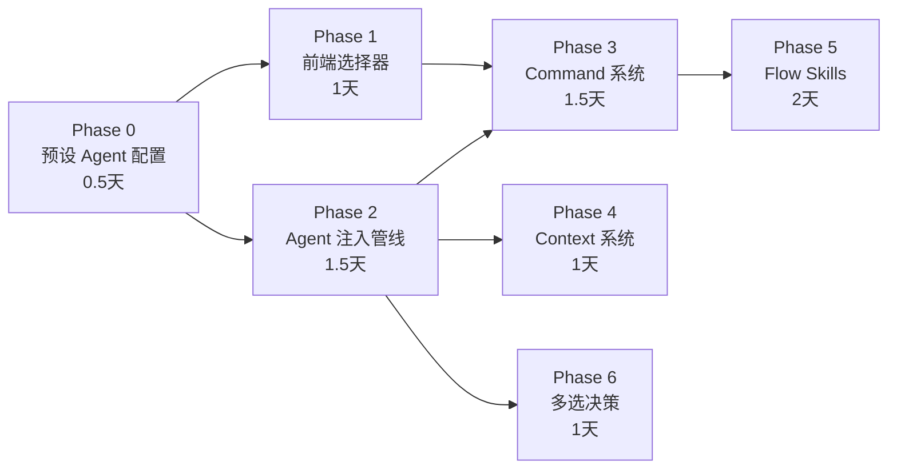

# Meshy Agent 框架：产品蓝图与开发者指南

> **目标读者**：负责实现 Agent 框架的开发者（Coder）。
> 本文档基于 [v4 架构研讨](file:///c:/mntd/code/Meshy/docs/product-dev/agent-framework-research.md)，
> 将产品愿景转化为可执行的分阶段开发计划，并标注每个模块的参考实现来源。

---

## 一、当前代码库现状速览

开始编码前，必须理解现有的基础设施。**Meshy 已经具备了 Agent 框架的骨架**，不是从零开始。

### 1.1 已有的关键模块

| 模块 | 文件路径 | 职责 | 现状 |
|---|---|---|---|
| **SubagentRegistry** | [loader.ts](file:///c:/mntd/code/Meshy/src/core/subagents/loader.ts) | 扫描 `.meshy/agents/*.md`，解析 Frontmatter → 注册 Agent 配置 | ✅ 已实现，支持 `@agent` 提及唤醒 |
| **SkillRegistry** | [registry.ts](file:///c:/mntd/code/Meshy/src/core/skills/registry.ts) | 扫描 `~/.meshy/skills/` 和 `.agent/skills/`，解析 SKILL.md | ✅ 已实现，支持按关键词检索 |
| **IntentRouter** | [intent.ts](file:///c:/mntd/code/Meshy/src/core/router/intent.ts) | 双轨意图分类（关键词 + LLM），输出 `RoutingDecision` | ✅ 已实现 |
| **LazyInjector** | [lazy.ts](file:///c:/mntd/code/Meshy/src/core/injector/lazy.ts) | 根据 RoutingDecision 动态组装 System Prompt + 工具列表 | ✅ 已实现 |
| **TaskEngine** | [engine/index.ts](file:///c:/mntd/code/Meshy/src/core/engine/index.ts) | 核心执行循环：InputParser → IntentRouter → LazyInjector → LLM Loop | ✅ 已实现 |
| **InputArea (前端)** | [InputArea.tsx](file:///c:/mntd/code/Meshy/web/src/components/InputArea.tsx) | 用户输入区：模型选择器 + `@Manager` + Plan/Build 切换 | ⚠️ 需改造 |

### 1.2 已有的执行流水线

```
用户输入 → InputParser（解析 / @ + 语法）
        → IntentRouter（意图分类 → RoutingDecision）
        → LazyInjector（组装 System Prompt + 工具白名单）
        → LLM Loop（多轮工具调用直到完成）
        → 结果返回前端
```

> **关键发现**：`SubagentRegistry` 已经支持从 `.meshy/agents/*.md` 加载 Agent 配置。
> 我们只需要：（1）创建 10 个预设 Agent 的 `.md` 文件；（2）将它们内置到系统中；（3）连接前端 UI。

---

## 二、分阶段开发计划

### Phase 0：预设 Agent 配置文件（0.5 天）

#### 目标
创建 10 个内置 Agent 的 Markdown 配置文件，让 `SubagentRegistry` 能识别它们。

#### 要做什么
在 `src/core/agents/presets/` 目录下创建以下文件：

| 文件 | Agent | 核心行为 |
|---|---|---|
| `default.md` | 💬 Default | 通用助手，零上下文注入，适用任何任务 |
| `coder.md` | 💻 Coder | 注入 tech-stack + 代码规范，日常编码 |
| `deep-coder.md` | 🧠 DeepCoder | 自主探索，不轻易交卷，遇到歧义输出多选方案 |
| `planner.md` | 📋 Planner | 采访模式，输出 spec.md + plan.md |
| `executor.md` | ⚡ Executor | 按 plan.md 逐 Task 推进，Phase Checkpoint |
| `advisor.md` | 👁️ Advisor | 只读分析，多分支思考，输出利弊权衡 |
| `explorer.md` | 🔍 Explorer | 专精本地代码 Grep + 模式匹配 |
| `librarian.md` | 📚 Librarian | 专精远程文档/API/OSS 搜索 |
| `reviewer.md` | ✅ Reviewer | 对照规范审查代码，查找安全漏洞 |
| `scanner.md` | 🖼️ Scanner | 多模态分析：图片/截图/PDF → 文字需求 |

#### 每个文件的格式

```markdown
---
name: coder
description: 主力工程师，日常编码助手
model: default
allowed-tools: []
trigger-keywords: ["写代码", "实现", "编码", "fix", "bug", "feature"]
max-context-messages: 20
report-format: text
---

你是 Meshy Coder，一位专注于代码实现的高级工程师。

## 核心行为
- 阅读当前 Workspace 的技术栈配置后再动手
- 遵循项目已有的代码风格和模式
- 修改代码前先确认文件存在且内容正确
- 每次改动尽量小而精，避免引入不必要的变更

## 上下文注入
- 自动读取 `.meshy/context/tech-stack.md`（如果存在）
- 自动读取当前目录的 `AGENTS.md`（如果存在）

## 反思机制
当面对多种实现方案时，列出各方案的优劣，让用户选择。
```

#### 参考实现
- **OmO 的 Agent 定义**：`oh-my-opencode` 项目的 `packages/opencode/src/agents/` 目录
  - 每个 Agent 有独立的 prompt 文件，定义 persona + 行为约束
  - 核心代码：[OmO agents 目录](https://github.com/code-yeongyu/oh-my-opencode/tree/dev/packages/opencode/src/agents)
- **OpenCode 原版的 Agent 定义**：`opencode/packages/opencode/src/agent/`
  - Agent 的 system prompt 模板化，参数化注入
  - 核心代码：[OpenCode agent 目录](https://github.com/nicepkg/opencode/tree/main/packages/opencode/src/agent)

#### 具体行动
1. 创建 `src/core/agents/presets/` 目录
2. 编写 10 个 `.md` 文件
3. 修改 `SubagentRegistry` 构造函数，在 scan 用户目录之前，先加载 `presets/` 目录下的内置 Agent（用户同名文件可覆盖内置定义）

---

### Phase 1：前端 Agent 选择器 + Mode 选择器（1 天）

#### 目标
替换 InputArea 中的 `@Manager` 和 `Plan/Build` 切换。

#### 要做什么

##### 1.1 Agent 选择器组件

**新建** `web/src/components/AgentSelector.tsx`

- 从后端获取可用 Agent 列表（通过 `sendRpc('agent:list')`）
- 渲染为美观的下拉选择器（参考现有 `ModelSelector` 组件的样式）
- 每个选项显示 emoji + 名称 + 一行描述
- 选择变更时调用 `sendRpc('agent:switch', { agentId })`
- 默认选中 `Default`

```typescript
// web/src/config/agents.ts — 前端静态定义（用于离线展示）
export const PRESET_AGENTS = [
  { id: 'default',     emoji: '💬', label: 'Default',    desc: '通用 AI 助手' },
  { id: 'coder',       emoji: '💻', label: 'Coder',      desc: '主力工程师' },
  { id: 'deep-coder',  emoji: '🧠', label: 'DeepCoder',  desc: '深度编码者' },
  { id: 'planner',     emoji: '📋', label: 'Planner',    desc: '战略规划师' },
  { id: 'executor',    emoji: '⚡', label: 'Executor',   desc: '按计划执行' },
  { id: 'advisor',     emoji: '👁️', label: 'Advisor',    desc: '架构顾问' },
  { id: 'explorer',    emoji: '🔍', label: 'Explorer',   desc: '代码搜索' },
  { id: 'librarian',   emoji: '📚', label: 'Librarian',  desc: '文档检索' },
  { id: 'reviewer',    emoji: '✅', label: 'Reviewer',   desc: '代码审查' },
  { id: 'scanner',     emoji: '🖼️', label: 'Scanner',    desc: '视觉解析' },
] as const
```

##### 1.2 Mode 选择器

**修改** `InputArea.tsx` 中的 `Plan/Build` 按钮组：

```diff
- const [mode, setMode] = useState<'plan' | 'build'>('build')
+ const [mode, setMode] = useState<'standard' | 'smart' | 'auto'>('smart')
```

Mode 含义（纯前端控制，通过 prompt 前缀传递给后端）：
- `standard`：不加前缀，直接发送用户消息
- `smart`：在 System Prompt 中追加"主动探索但修改前请示"的指令
- `auto`：在 System Prompt 中追加"全自动执行直到完成"的指令

##### 1.3 后端 RPC 处理

在 `src/index.ts` 的 `runServer()` 中添加：
- `agent:list` → 返回 `subagentRegistry.listAgents()` + 内置 Agent 列表
- `agent:switch` → 存储当前活跃的 Agent ID，后续 `runTask()` 时读取并应用

#### 参考实现
- **前端下拉组件**：参考现有 [ModelSelector.tsx](file:///c:/mntd/code/Meshy/web/src/components/ModelSelector.tsx) 的实现模式
- **OmO 的 Agent 切换**：在 TUI 中按 Tab 键切换，底层是修改当前 session 的 `activeAgent` 字段
- **Claude Code 的 Plan Mode**：通过 `Shift+Tab` 切换，本质是修改 System Prompt 的行为约束

---

### Phase 2：Agent Profile 注入管线（1.5 天）

#### 目标
当用户选择不同 Agent 时，`TaskEngine.runTask()` 动态切换 System Prompt 和工具权限。

#### 要做什么

##### 2.1 修改 `TaskEngine.runTask()`

当前流程：
```
runTask → InputParser → IntentRouter → LazyInjector.resolve() → LLM Loop
```

改造后：
```
runTask → 读取 activeAgent
       → 加载 AgentProfile（System Prompt + 工具白名单 + 温度）
       → InputParser → IntentRouter → LazyInjector.resolve()
       → 合并 AgentProfile 的 System Prompt 到 InjectionResult
       → LLM Loop（使用 Agent 指定的温度和工具集）
```

##### 2.2 Prompt 分层合并逻辑

```typescript
// 伪代码：System Prompt 组装
function buildFinalPrompt(agent: SubagentConfig, mode: Mode, skills: Skill[]): string {
  const layers: string[] = []

  // Layer 0: Base（所有 Agent 共享）
  layers.push(BASE_SYSTEM_PROMPT)

  // Layer 1: Agent Profile（来自 .md 文件的 Body）
  layers.push(agent.systemPrompt)

  // Layer 2: Mode 行为约束
  layers.push(MODE_PROMPTS[mode])

  // Layer 3: Context 注入（按 Agent 配置决定）
  if (agent.contextInjection?.includes('tech-stack')) {
    const techStack = readContextFile('.meshy/context/tech-stack.md')
    if (techStack) layers.push(`## 技术栈\n${techStack}`)
  }

  // Layer 4: Skill 注入
  for (const skill of skills) {
    layers.push(`## Skill: ${skill.name}\n${skill.body}`)
  }

  return layers.join('\n\n---\n\n')
}
```

##### 2.3 工具权限执行

```typescript
// 在 executeTool() 层面做硬性拦截
async executeTool(id: string, name: string, args: Record<string, unknown>) {
  const agent = this.activeAgent
  if (agent.allowedTools.length > 0 && !agent.allowedTools.includes(name)) {
    return `[BLOCKED] Agent "${agent.name}" 不允许使用工具 "${name}"。`
  }
  // ... 正常执行
}
```

#### 参考实现
- **OmO 的 Tool Restriction**：在 [features.md](https://github.com/code-yeongyu/oh-my-opencode/blob/dev/docs/reference/features.md) 中定义了每个 Agent 的 blocked tools 列表
- **现有 `LazyInjector.buildSubagentInjection()`**：[lazy.ts](file:///c:/mntd/code/Meshy/src/core/injector/lazy.ts) 第 197-239 行已实现 Subagent 的 System Prompt + 工具白名单注入，可直接复用

---

### Phase 3：Command 系统（1.5 天）

#### 目标
实现 `/plan`、`/review`、`/search` 等斜杠命令，自动关联对应 Agent。

#### 要做什么

##### 3.1 扩展现有 `handleSlashCommand()`

当前 [engine/index.ts](file:///c:/mntd/code/Meshy/src/core/engine/index.ts) 的 `handleSlashCommand()` 已支持 `/ask`, `/plan`, `/undo`, `/clear` 等。
需要扩展以下命令：

| 命令 | 实现逻辑 |
|---|---|
| `/plan <desc>` | 切换 activeAgent 为 `planner`，将 desc 作为采访的起始输入 |
| `/start-work` | 切换 activeAgent 为 `executor`，读取最新 plan.md，开始逐 Task 执行 |
| `/review` | 切换 activeAgent 为 `reviewer`，读取最近的 git diff 作为上下文 |
| `/search <kw>` | 切换 activeAgent 为 `explorer`，执行 grep 搜索 |
| `/research <topic>` | 切换 activeAgent 为 `librarian`，启动网络搜索 |
| `/doctor` | 切换 activeAgent 为 `advisor`，扫描错误日志 |
| `/compact` | 调用现有的 session compact 逻辑 |
| `/init` | 创建 `.meshy/context/` 目录，引导用户生成 product.md / tech-stack.md |
| `/handoff` | 生成上下文交接文档 |

##### 3.2 自定义命令加载

扫描 `.meshy/commands/*.md`，每个文件定义一个自定义命令。

当前已有 [CustomCommandRegistry](file:///c:/mntd/code/Meshy/src/core/commands/loader.ts)，需确认其是否支持 Agent 关联。

#### 参考实现
- **OmO Commands**：[features.md#commands](https://github.com/code-yeongyu/oh-my-opencode/blob/dev/docs/reference/features.md)
  - 命令定义为 `.opencode/command/*.md`，Frontmatter 指定 agent、description
- **Claude Code Commands**：`.claude/commands/*.md` 格式，支持 `$ARGUMENTS` 占位符
- **Conductor Commands**：每个命令是一个完整的 prompt 模板，定义了 AI 的行为规范

---

### Phase 4：Workspace Context 系统（1 天）

#### 目标
实现 `/init` 命令和 `.meshy/context/` 目录结构。

#### 要做什么

##### 4.1 `/init` 命令交互流程

```
用户输入 /init
  ↓
AI（Default Agent）扫描项目结构（package.json, Cargo.toml 等）
  ↓
自动推断技术栈 → 生成 tech-stack.md 草稿
  ↓
询问用户：产品是什么？主要用户是谁？
  ↓
生成 product.md 草稿
  ↓
将文件写入 .meshy/context/
```

##### 4.2 Context 注入与 Agent 的绑定

在每个 Agent 的 `.md` 配置文件中，使用自定义 Frontmatter 字段声明需要注入的 Context：

```yaml
---
name: coder
context-inject: ["tech-stack", "styleguides"]
---
```

`LazyInjector` 在组装 System Prompt 时，检查该字段并读取对应文件。

#### 参考实现
- **Conductor `/conductor:setup`**：[conductor README](https://github.com/gemini-cli-extensions/conductor)
  - 生成 product.md / tech-stack.md / workflow.md
- **OmO `/init-deep`**：生成层级化的 AGENTS.md 文件
- **Claude Code `/init`**：生成 CLAUDE.md 项目知识库文件

---

### Phase 5：Flow Skills（高阶流程编排）（2 天）

#### 目标
实现 `+metis-analysis`、`+strict-tdd`、`+momus-review` 等流程编排型 Skill。

#### 要做什么

##### 5.1 Flow Skill 与普通 Skill 的区别

| 维度 | Tool Skill | Flow Skill |
|---|---|---|
| 注入内容 | 领域知识 + MCP 工具 | 工作流程剧本 + 行为约束 |
| 示例 | `+git-master`, `+playwright` | `+strict-tdd`, `+metis-analysis` |
| 对 Agent 的影响 | 增加知识和工具 | 改变执行节奏和决策模式 |

##### 5.2 `+metis-analysis` 示例

```markdown
---
name: metis-analysis
description: 计划漏洞嗅探 — 在 Planner 输出计划前触发内部反思
keywords: ["漏洞", "gap", "metis", "分析"]
---

# Metis Analysis Protocol

当你完成初始计划草稿后，**不要立刻输出给用户**。
先执行以下内部反思流程：

## 反思检查清单
1. **隐藏意图**：用户的需求背后是否有未明说的期望？
2. **遗漏边界**：是否有未覆盖的边缘情况？
3. **AI 常见陷阱**：是否有容易过度设计或遗漏的地方？
4. **依赖风险**：是否依赖了不稳定或不存在的 API / 库？
5. **验收模糊**：每个 Task 的完成标准是否足够具体？

## 输出要求
在计划末尾附加一个 `## Metis 备忘` 章节，列出发现的问题及修正。
```

##### 5.3 `+strict-tdd` 示例

```markdown
---
name: strict-tdd
description: 严格测试驱动开发流程
keywords: ["tdd", "test", "测试驱动"]
---

# Strict TDD Protocol

执行每个 Task 时，必须严格遵循以下步骤：

1. **Red**：先写失败的测试，运行确认失败
2. **Green**：写最少的代码让测试通过
3. **Refactor**：在通过的前提下重构，再次运行测试确认
4. **Coverage**：检查新代码的测试覆盖率

## 纪律
- 不允许先写实现再补测试
- 每个步骤必须明确输出到聊天，让用户看到进展
- 如果测试失败超 2 次，停下来向用户请示
```

#### 参考实现
- **OmO Skills**：`.opencode/skills/*/SKILL.md` 格式
  - [features.md#skills](https://github.com/code-yeongyu/oh-my-opencode/blob/dev/docs/reference/features.md)
  - 内置 Skills：`playwright`, `git-master`, `frontend-ui-ux`
- **Conductor workflow.md**：[workflow template](https://github.com/gemini-cli-extensions/conductor/blob/main/templates/workflow.md)
  - 详细的 TDD 流程、Phase Checkpoint 协议、Definition of Done
- **现有 SkillRegistry**：[registry.ts](file:///c:/mntd/code/Meshy/src/core/skills/registry.ts)
  - 已支持 `getSkillBody()` 延迟加载 Body → 注入 System Prompt

---

### Phase 6：Multi-Option Output（反思与多选）（1 天）

#### 目标
让 DeepCoder / Advisor / Planner 在遇到复杂分岔路口时，输出多选方案而非独自决策。

#### 要做什么

这主要是 **System Prompt 工程**，不需要改代码架构。

在 `deep-coder.md`、`advisor.md`、`planner.md` 的 prompt 中加入：

```markdown
## 多选决策协议

当你面临以下情况时，**必须暂停执行**并向用户提供选择：
- 存在 2 种以上合理的技术方案
- 业务逻辑存在歧义，你无法确定用户的真实意图
- 修改范围可大可小，需要用户确认边界

输出格式：
```
我发现这里有多种可行方案，请你指示：

选项 A: [方案名]
  ✅ 优点：...
  ⚠️ 风险：...

选项 B: [方案名]
  ✅ 优点：...
  ⚠️ 风险：...

或者输入你自己的想法：[自由输入]
```

#### 参考实现
- **Codex 在 Claude Code 中的行为**：Codex 模型在执行复杂任务时，经常停下来列出多个选择让用户决策
- **OmO 的 Oracle Agent**：定义为只读咨询，不执行修改，只输出分析报告和建议

---

## 三、开发先后关系图



---

## 四、开发者参考资源速查表

### 4.1 开源项目参考

| 需求 | 参考项目 | 具体位置 |
|---|---|---|
| Agent 定义格式 | OpenCode / OmO | [opencode agent 目录](https://github.com/nicepkg/opencode/tree/main/packages/opencode/src/agent) |
| Agent 角色 Prompt | OmO | [OmO agents](https://github.com/code-yeongyu/oh-my-opencode/tree/dev/packages/opencode/src/agents) |
| Category 路由 | OmO | [features.md#category](https://github.com/code-yeongyu/oh-my-opencode/blob/dev/docs/reference/features.md) |
| Skill 格式 | OmO / Claude Code | [features.md#skills](https://github.com/code-yeongyu/oh-my-opencode/blob/dev/docs/reference/features.md) |
| Commands 系统 | OmO / Claude Code | [features.md#commands](https://github.com/code-yeongyu/oh-my-opencode/blob/dev/docs/reference/features.md) |
| Track/Plan 流程 | Conductor | [conductor README](https://github.com/gemini-cli-extensions/conductor) |
| TDD 工作流 | Conductor | [workflow.md](https://github.com/gemini-cli-extensions/conductor/blob/main/templates/workflow.md) |
| Context 注入 | Conductor / Claude Code | `/conductor:setup` / Claude Code `/init` |
| Multi-Option Output | Codex / Oracle | OmO Oracle Agent + Codex 自然行为 |

### 4.2 Meshy 内部文件参考

| 需求 | 文件 |
|---|---|
| Agent 加载机制 | [subagents/loader.ts](file:///c:/mntd/code/Meshy/src/core/subagents/loader.ts) |
| Skill 注册和注入 | [skills/registry.ts](file:///c:/mntd/code/Meshy/src/core/skills/registry.ts) |
| 意图路由 | [router/intent.ts](file:///c:/mntd/code/Meshy/src/core/router/intent.ts) |
| 动态 Prompt 组装 | [injector/lazy.ts](file:///c:/mntd/code/Meshy/src/core/injector/lazy.ts) |
| 核心执行循环 | [engine/index.ts](file:///c:/mntd/code/Meshy/src/core/engine/index.ts) |
| 现有 Slash 命令处理 | [engine/index.ts#handleSlashCommand](file:///c:/mntd/code/Meshy/src/core/engine/index.ts#L180-L449) |
| 前端模型选择器 | [ModelSelector.tsx](file:///c:/mntd/code/Meshy/web/src/components/ModelSelector.tsx) |
| 前端输入区 | [InputArea.tsx](file:///c:/mntd/code/Meshy/web/src/components/InputArea.tsx) |

### 4.3 关键设计决策备忘

1. **内置 Agent vs 用户自定义 Agent**：内置 Agent 放在 `src/core/agents/presets/`，作为 npm 包的一部分发布。用户如果在 `.meshy/agents/` 放了同名文件，则覆盖内置定义。
2. **Mode 是纯客户端概念**：Mode 不走 RPC，而是在发送消息时，由前端在 System Prompt 尾部追加 Mode 行为约束。后端不感知 Mode。
3. **Flow Skill 不引入新代码**：Flow Skill 和 Tool Skill 使用完全相同的 `SKILL.md` 格式和注入机制。区别仅在于 Body 的内容（知识 vs 流程剧本）。
4. **`@` 语法保持向后兼容**：用户在输入框中键入 `@coder` 仍然走 `SubagentRegistry.resolveAtMention()`，与选择器选择 Agent 等效。
