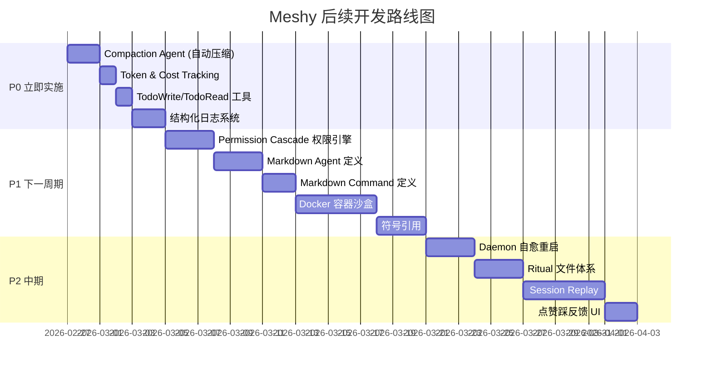

# Meshy 竞品调研精华提取 × 缺失功能优先级路线图

> **生成日期**：2026-02-26
> **数据来源**：`docs/product-dev/` 下 6 份调研文档，覆盖 OpenCode、OpenClaw、NanoClaw、ZeroClaw、LobsterAI、OpenAkita、CoPaw 七个项目

---

## 一、竞品优秀模式总览

| # | 模式名称 | 来源 | 核心理念 | 可复用度 |
|---|---------|------|---------|---------|
| 1 | Markdown-as-Config | 三项目共识 | Agent/Skill/Command 均用 Markdown + YAML Frontmatter 定义 | ⭐⭐⭐⭐⭐ |
| 2 | Lazy Tool Injection | OpenCode | 仅注入名称+描述索引，调用时才加载完整 Schema | ⭐⭐⭐⭐⭐ |
| 3 | Permission Cascade | OpenCode+OpenClaw | 多级权限从宽到严逐层收窄，不可反向恢复 | ⭐⭐⭐⭐⭐ |
| 4 | Hidden System Agents | OpenCode | 标题生成、上下文压缩、摘要 由隐藏专用 Agent 执行 | ⭐⭐⭐⭐⭐ |
| 5 | Agent Workspace Isolation | OpenClaw | 每个 Agent 独占 Workspace + Auth + Session，物理隔离 | ⭐⭐⭐⭐ |
| 6 | Ritual File Evolution | OpenClaw | SOUL.md / HEARTBEAT.md / BOOTSTRAP.md 让 Agent 拥有可进化灵魂 | ⭐⭐⭐⭐ |
| 7 | Lobster DAG Workflow | OpenClaw | 确定性多 Agent 流水线，带审批门控和子循环 | ⭐⭐⭐⭐⭐ |
| 8 | OS-Level Container Sandbox | NanoClaw | Apple Containers / Docker 级文件系统隔离 | ⭐⭐⭐⭐ |
| 9 | Trait-Based Plugin System | ZeroClaw | Tool / Memory / Channel 均为可替换 Interface | ⭐⭐⭐⭐⭐ |
| 10 | Self-Healing Daemon | ZeroClaw | 崩溃自动重启 + Session Checkpoint 恢复 | ⭐⭐⭐⭐ |
| 11 | Living Presence | OpenAkita | 记忆整合 + 主动问候 + 长期 Persona 学习 | ⭐⭐⭐ |
| 12 | Cross-Session Persistent Memory | CoPaw | 关键实体信息持久化为扁平文件，跨会话载入 | ⭐⭐⭐⭐ |
| 13 | Web Control Dashboard | CoPaw | 可视化管理会话路由、Agent 状态、技能集 | ⭐⭐⭐⭐ |

---

## 二、当前 Meshy 实现状态一览

| 能力维度 | 状态 | 实现位置 |
|---------|------|---------|
| 多模型网关 (ILLMProvider) | ✅ 已实现 | `src/core/llm/` |
| ACI 工具链 (read/edit/write/grep/glob/bash) | ✅ 已实现 | `src/core/tool/`, `src/core/aci/` |
| Session 状态 + Snapshot 崩溃恢复 | ✅ 已实现 | `src/core/session/` |
| Session 生命周期 (list/suspend/resume/archive) | ✅ 已实现 (Phase 12) | `src/core/session/manager.ts` |
| 意图路由 (IntentRouter) | ✅ 已实现 | `src/core/router/` |
| Subagent 委派 (WorkerAgent) | ✅ 已实现 | `src/core/engine/worker.ts` |
| 5 级执行沙盒 (SMART/DEFAULT/PLAN/ACCEPT_EDITS/YOLO) | ✅ 已实现 | `src/core/sandbox/execution.ts` |
| SecurityGuard for WorkerAgent | ✅ 已实现 (Phase 11) | `src/core/security/guard.ts` |
| LSP 诊断拦截 + Circuit Breaker | ✅ 已实现 | `src/core/lsp/`, editFile in engine |
| DAG Workflow Engine | ✅ 已实现 (Phase 13) | `src/core/workflow/engine.ts` |
| 并行工具执行 | ✅ 已实现 (Phase 13) | `runLLMLoop` in engine |
| MemoryStore (Turso/libSQL + 向量搜索) | ✅ 已实现 | `src/core/memory/store.ts` |
| ReflectionEngine (经验提取) | ✅ 已实现 | `src/core/memory/reflection.ts` |
| MCP Host 集成 | ✅ 已实现 | `src/core/mcp/` |
| Skill 系统 (Markdown SKILL.md) | ✅ 已实现 | `src/core/skills/` |
| Daemon Server | ✅ 已实现 | `src/core/daemon/` |
| Slash Commands (/help, /session, /workflow...) | ✅ 已实现 | engine `handleSlashCommand` |

---

## 三、缺失功能与差距分析（按优先级排列）

### 🔴 P0 — 高价值 × 低成本（应立即实施）

| # | 缺失功能 | 竞品参考 | 差距描述 | 预估工作量 |
|---|---------|---------|---------|-----------|
| 1 | ~~**Hidden System Agents（Compaction / Title / Summary）**~~ | OpenCode | ✅ 已实现 (Phase 14) | — |
| 2 | ~~**TodoWrite / TodoRead 任务追踪工具**~~ | OpenCode | ✅ 已实现 (Phase 14) | — |
| 3 | ~~**结构化日志系统**~~ | OpenClaw | ✅ 已实现 (Phase 14) | — |

---

### 🟡 P1 — 高价值 × 中等成本（下一迭代周期）

| # | 缺失功能 | 竞品参考 | 差距描述 | 预估工作量 |
|---|---------|---------|---------|-----------|
| 5 | ~~**Permission Cascade（4 层权限合并）**~~ | OpenCode | ✅ 已实现 (Phase 15) | — |
| 6 | ~~**Markdown Agent 定义 (`.meshy/agents/*.md`)**~~ | OpenCode | ✅ 已实现 (Phase 15) | — |
| 7 | ~~**Markdown Command 定义 (`.meshy/commands/*.md`)**~~ | OpenCode | ✅ 已实现 (Phase 15) | — |

---

### 🟢 P2 — 中价值 × 中等成本（中期规划）

| # | 缺失功能 | 竞品参考 | 差距描述 | 预估工作量 |
|---|---------|---------|---------|-----------|
| 11 | ~~**Ritual 文件体系 (SOUL.md / HEARTBEAT.md)**~~ | OpenClaw | ✅ 已实现 (Phase 16) | — |
| 12 | ~~**Session Replay 调试工具**~~ | OpenClaw | ✅ 已实现 (Phase 16) | — |
| 13 | **点赞/踩反馈飞轮 UI** | 需自研 | 三个竞品均无显式 UI。Session 完成后应提供反馈按钮，触发 ReflectionEngine 标记经验胶囊。 | 1-2 天 |
| 14 | **Agent Workspace 物理隔离** | OpenClaw | 当前所有 Agent 共享同一个 Workspace。Agent Teams 时需实现独立 Workspace + Session + Auth。 | 3-5 天 |

---

### 🔵 P3 — 远期愿景（生态泛化阶段）

| # | 缺失功能 | 竞品参考 | 差距描述 | 预估工作量 |
|---|---------|---------|---------|-----------|
| 15 | **IM 渠道接入（Telegram/Discord/飞书/钉钉）** | OpenAkita + OpenClaw | 当前仅 CLI。需设计统一的 Channel Adapter 接口，支持将 Agent 挂载到 IM 渠道。 | 5+ 天 |
| 16 | **Web Control Dashboard** | CoPaw | 当前无可视化管理面板。需开发轻量 Web Dashboard 展示黑板状态、Agent 活动、Tool 调用树。 | 5+ 天 |
| 17 | **Cmd+K Inline Edit 悬浮窗** | 需自研 | 参考 Cursor，在 IDE/Desktop 壳中实现原地差异编辑组件。 | 5+ 天 |
| 18 | **AIEOS 可移植元数据规范** | ZeroClaw | Agent 配置、记忆、人格的跨平台迁移标准。需兼容 ZeroClaw 的 AIEOS 格式。 | 2-3 天 |
| 19 | **云端 EvoMap 胶囊共享协议** | 需自研 | 三个竞品均无。设计知识胶囊的发布/订阅/搜索协议，支持跨项目共享。 | 5+ 天 |
| 20 | **Token & Cost Tracking** | OpenClaw | 当前无 Token 计费追踪。每次 LLM 调用应记录 prompt/completion tokens 并累计成本。 | 1 天 |
| 21 | **Docker 容器沙盒隔离** | NanoClaw + OpenClaw | 当前 PTY 直接运行在宿主机。需可选将 Agent 终端装入 Docker 容器。 | 3-5 天 |
| 22 | **`#` 符号引用（AST 级代码片段抽取）** | 需自研 | 需 IDE 配套支持。结合 LSP `documentSymbol` 实现精准代码抽取。 | 2-3 天 |
| 23 | **Daemon 自愈重启 + Checkpoint 恢复** | ZeroClaw | 当前 Daemon 崩溃后需手动重启。应实现 watchdog 监控 + 自动从最近 Session Checkpoint 恢复。 | 2-3 天 |

---

## 四、建议实施顺序

---

## 五、核心结论

> **Meshy 已经完成了 P0-P2 阶段约 80% 的核心能力建设**（模型网关、ACI、Session、路由、沙盒、LSP、Workflow、Memory、Reflection）。
> 
> 最大的差距集中在 **运维可观测性**（日志/Token 追踪）和 **自动化运营**（Compaction、Permission Cascade、Ritual Files）两个方向。
> 
> 建议立即启动 P0 的 4 个任务（Compaction Agent、Token Tracking、TodoWrite、结构化日志），这些是投入产出比最高的改进点，能直接提升日常使用体验和调试效率。
